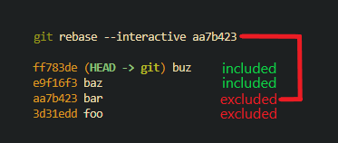
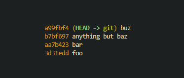

You can edit your most recent commit message by running `git commit --amend`.

If you've already pushed out your commit, you'll have to tell the remote git repository that you intend to rewrite history. You can do this by running `git push --force-with-lease` after amending your commit.

## editing older commit messages

You can edit older commits with an interactive rebase. A rebase is a way to deconstruct and reconstruct older commits. You can modify things like the files changed in a commit, if the commit was signed, when the commit was created, who it was created by, and in our case you can edit commit messages.

The first step of a rebase is identifying the rebase's span. Run `git log --oneline` to get a top-down list of your latest commits. Find the commit you want to edit, then select the commit hash after it and run `git rebase --interactive $HASH`

In the below example, If we want to edit the commit message `baz [e9f16f3]`, we will want to run an interactive rebase on `bar [aa7b423]`



After you run this command, git will start a rebase and your configured git editor will give you a prompt asking how you want to proceed with the rebase. It's worth reading this prompt entirely if you've never seen it before. I'll summarize what's needed for changing the commit message below this codeblock.

```fish
pick e9f16f3 baz
pick ff783de buz

# Rebase aa7b423..ff783de onto aa7b423 (2 commands)
#
# Commands:
# p, pick <commit> = use commit
# r, reword <commit> = use commit, but edit the commit message
# e, edit <commit> = use commit, but stop for amending
# s, squash <commit> = use commit, but meld into previous commit
# f, fixup [-C | -c] <commit> = like "squash" but keep only the previous
#                    commit's log message, unless -C is used, in which case
#                    keep only this commit's message; -c is same as -C but
#                    opens the editor
# x, exec <command> = run command (the rest of the line) using shell
# b, break = stop here (continue rebase later with 'git rebase --continue')
# d, drop <commit> = remove commit
# l, label <label> = label current HEAD with a name
# t, reset <label> = reset HEAD to a label
# m, merge [-C <commit> | -c <commit>] <label> [# <oneline>]
# .       create a merge commit using the original merge commit's
# .       message (or the oneline, if no original merge commit was
# .       specified); use -c <commit> to reword the commit message
#
# These lines can be re-ordered; they are executed from top to bottom.
#
# If you remove a line here THAT COMMIT WILL BE LOST.
#
# However, if you remove everything, the rebase will be aborted.
#
```

The file you're editing is a `git-rebase-todo` file. It's used as a catalog of actions you intend to perform with each commit. It includes the action you want to do, the commit hash, and the commit message for easy identification. It's also bottom-up instead of top-down (your newest commits are at the bottom).

`pick` is the default action. Commits prefixed with `pick` are left intact as they were before the rebase began. Since we want to edit the commit message "baz" The action we want to use is `reword`. Edit your git-rebase-todo file and change the word `pick` to `reword` like so

```fish
reword e9f16f3 baz
pick ff783de buz

# Rebase aa7b423..ff783de onto aa7b423 (2 commands)
#
# Commands:
# p, pick <commit> = use commit
# r, reword <commit> = use commit, but edit the commit message
# e, edit <commit> = use commit, but stop for amending
# s, squash <commit> = use commit, but meld into previous commit
# f, fixup [-C | -c] <commit> = like "squash" but keep only the previous
#                    commit's log message, unless -C is used, in which case
#                    keep only this commit's message; -c is same as -C but
#                    opens the editor
# x, exec <command> = run command (the rest of the line) using shell
# b, break = stop here (continue rebase later with 'git rebase --continue')
# d, drop <commit> = remove commit
# l, label <label> = label current HEAD with a name
# t, reset <label> = reset HEAD to a label
# m, merge [-C <commit> | -c <commit>] <label> [# <oneline>]
# .       create a merge commit using the original merge commit's
# .       message (or the oneline, if no original merge commit was
# .       specified); use -c <commit> to reword the commit message
#
# These lines can be re-ordered; they are executed from top to bottom.
#
# If you remove a line here THAT COMMIT WILL BE LOST.
#
# However, if you remove everything, the rebase will be aborted.
#
```

After you've made your changes, save the file and close it. Git will then prompt you to edit the commit message. 

```fish
baz # change this line to anything but baz

# Please enter the commit message for your changes. Lines starting
# with '#' will be ignored, and an empty message aborts the commit.
#
# Date:      Sun Feb 26 00:19:24 2023 -0700
#
# interactive rebase in progress; onto aa7b423
# Last command done (1 command done):
#    reword e9f16f3 baz
# Next command to do (1 remaining command):
#    pick ff783de buz
# You are currently editing a commit while rebasing branch 'git' on 'aa7b423'.
#
# Changes to be committed:
#	new file:   baz
#
```

Once you've made your commit message changes, save the file and close it. Git will finalize the rebase, and you can run `git log --oneline` to inspect the changes. To push your chnages to the remote git repository, you'll have to run `git push --force-with-lease` here as well


