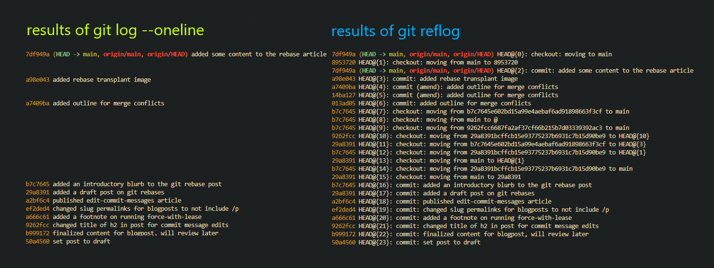
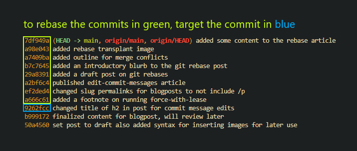

Have you or a loved one ever wanted to:

- delete a commit
- edit the content of a commit
- remove a specific file that was accidentally added to a commit
- include missed files in a commit
- fix a typo in an old commit message
- combine a bunch of commits together
- sign older commits
- change what branch you've forked from

If you've worked with git, you've likely needed to do at least one of these at some point. And if you're like me, you've probably tried to read the `--help` documentation of git to figure out how to do some of these things, and oh boy the docs can be hard to read. This article is a reference on what you can do with git rebases, and how to do it.

## A Disclaimer About Controversy

Rebasing involves rewriting history.
Rewriting history involves force pushing to overwrite the remote state of a repository.
Force pushing has the potential to delete others work (if you rebase recklessly).


Rewriting history is controversial. Some say it's okay to modify history because it's sometimes necessary and can enhance git history. Others say it's not okay because git is supposed to be a historical representation of all changes, and you should prefer to roll your fixes forward. In my opinion if your historical modifications don't impact others, it should be acceptable to rewrite history. It's important when managing git history to ensure that you aren't impacting other people's work. You should follow these general practices:

- Always use `--force-with-lease` when pushing out rebases.
- Avoid rewriting history if you're collaborating with others on the same branch.
- If you have to rebase changes while working with others, `git pull` often to always make sure you're working with the latest content.
- Don't edit other people's commits unless they know about and consent to the edits.

## So What is a Git Rebase?

A git rebase is the act of disassembling and reassembling a range of commits. The function's name comes from its original purpose of changing the forked location of your branch to a different commit or branch. There are two general types of rebases. Ones that require human interaction to complete, and ones that do not. A human interactive rebase would involve doing things like adding, editing, deleting, combining, and splitting commits. A noninteractive rebase would be attaching your base to a different branch.

Interactive rebases are executed by running `git rebase --interactive $GITREVISION`
Noninteractive rebases are executed by running `git rebase $GITREVISION`

## How do I Git Rebase?


### Determine What Commits to Rebase

You can use most valid forms of [gitrevision syntax](https://git-scm.com/docs/gitrevisions), but `git log --oneline` and `git reflog` are the most common options for discovering historical edits. `git log --oneline` will only show you commits. `git reflog` will show you commits in addition to actions you take like checking out branches, other rebases you've done, git resets, commit amends, and other historical modifications made to git. The only time I use referential syntax is if I'm recovering a previously deleted commit since git will locally log the commit even after deleting it.



Here's a table of a few valid gitrevision syntaxes you can use in a rebase, and what they roughly translate to.

|syntax|meaning|
|------|-------|
|`016a428`|rebase all commits between HEAD and `016a428`|
|`HEAD@{5}`|rebase all commits contained in my last 5 git actions|
|`HEAD~5`|rebase the last 5 commits|
|`HEAD@{5hr}`|rebase all commits made in the last 5 hours|
|`':/^Foo'`|rebase all commits made between HEAD and the first commit found with a commit message that matches the regular expression `^Foo`|



### Edit Your git-rebase-todo

A `git-rebase-todo` file is a manifest containing all the commits in your rebase that you can edit to instruct git on what changes you want to make. It includes the action you want to do, the commit hash, and the commit message for easy identification. An example looks like this:

```fish
pick e9f16f3 baz
pick ff783de buz

# Rebase aa7b423..ff783de onto aa7b423 (2 commands)
#
# Commands:
# p, pick <commit> = use commit
# r, reword <commit> = use commit, but edit the commit message
# e, edit <commit> = use commit, but stop for amending
# s, squash <commit> = use commit, but meld into previous commit
# f, fixup [-C | -c] <commit> = like "squash" but keep only the previous
#                    commit's log message, unless -C is used, in which case
#                    keep only this commit's message; -c is same as -C but
#                    opens the editor
# x, exec <command> = run command (the rest of the line) using shell
# b, break = stop here (continue rebase later with 'git rebase --continue')
# d, drop <commit> = remove commit
# l, label <label> = label current HEAD with a name
# t, reset <label> = reset HEAD to a label
# m, merge [-C <commit> | -c <commit>] <label> [# <oneline>]
# .       create a merge commit using the original merge commit's
# .       message (or the oneline, if no original merge commit was
# .       specified); use -c <commit> to reword the commit message
#
# These lines can be re-ordered; they are executed from top to bottom.
#
# If you remove a line here THAT COMMIT WILL BE LOST.
#
# However, if you remove everything, the rebase will be aborted.
#
```

The only commands in that list I haven't used are exec, break, label, reset, and merge.

### Start The Rebase

As soon as you save the `git-rebase-todo` file and close it, the rebase will start. The first step git does is it saves all your commits into a staging area for safekeeping if you need to perform any reversions. Then it goes through each commit oldest to newest. Actions like pick, squash, fixup, and drop will be executed automatically. Actions like reword and edit will pause for you to make your requested changes. If it's a git message change, it will open the commit message file and allow you to make your changes.

Edit steps are a bit more complex. Git has no idea what modifications you intend to make on the edit step, so you need to tell it when you're finished. You can make any changes you need to the commit, and once you're finished you run `git commit --amend` to add your content to the commit. Then run `git rebase --continue` to tell git you're done with the current commit.

## Deleting Commits

- determine what commits you want to delete by running `git log --oneline` and find the hash of the commit you intend to delete
```fish
486f3bf (HEAD -> main) e18155c658
28cabde 0523d2af6c
58098cf 5a0be3f060
add66be 8759405589 # let's delete this commit
76d462d f6ecfd8500
beeef8f (origin/main, origin/HEAD) Initial commit
```
- go one past that commit and copy its hash
- run `git rebase --interactive 76d462d`
- modify the `git-rebase-todo` to delete the commit
```fish
drop add66be 8759405589 # I've change the action on this commit to drop
pick 58098cf 5a0be3f060
pick 28cabde 0523d2af6c
pick 486f3bf e18155c658
```
- save and close the `git-rebase-todo`
- run `git push --force-with-lease` if working with remote changes to overwrite history

If everything worked, the commit should be gone. You can run `git log --oneline` to validate its deletion.
```fish
6144ecd (HEAD -> main) e18155c658
28971d0 0523d2af6c
ee09104 5a0be3f060
# yay the commit is gone!
76d462d f6ecfd8500
beeef8f (origin/main, origin/HEAD) Initial commit
```
## Editing Commit Content

- determine what commit you want to edit by running `git log --oneline` and find the hash of the commit you intend to modify
```fish
2f512ca (HEAD -> main) b8e34da2fb
1daec94 53a8322ae0
49338d3 1890202347 # let's edit this commit
6dd4f4e 3fc41f2708
10b8051 79d8d9fc4b
beeef8f Initial commit
```
- go one past that commit and copy its hash
- run `git rebase --interactive 6dd4f4e` 
- modify the `git-rebase-todo` to include your request to edit the commit
```fish
edit 49338d3 1890202347 # I've changed the action on this commit to edit
pick 1daec94 53a8322ae0
pick 2f512ca b8e34da2fb
```
- save and close the `git-rebase-todo`
- git will pause on the commit you want to edit
- make your changes and run `git commit --amend` to include the edits
- run `git rebase --continue` to tell git you're done making your changes
- run `git push --force-with-lease` if working with remote changes to overwrite history
```fish
2093981 (HEAD -> main) b8e34da2fb
d3ecdd3 53a8322ae0
12d9704 1890202347 # this commit has a new SHA meaning the changes went through!
6dd4f4e 3fc41f2708
10b8051 79d8d9fc4b
beeef8f Initial commit
```

If everything worked, the commit should be edited with a new SHA. You can run `git log --oneline` to validate its modification.

## Combining Commits by Squashing


## Changing the Base of Your Branch

An example of that might be if you created branch `topic` while checked into branch `next` instead of branch `master` and you've already committed content you don't want to lose. `git rebase --help` has some nicely defined diagrams of what this would look like as illustrated below, or [here](https://git-scm.com/docs/git-rebase) if you want to read the official docs.

## Signing Older Commits

The easiest way to sign your older commits is to setup your git config to automatically sign commits, then execute a rebase on all your commits. If this sounds like too much, it might be best to just leave your commits unsigned. Github has excellent documentation on setting up commit signatures [here](https://docs.github.com/en/authentication/managing-commit-signature-verification/signing-commits) and how to automatically sign commits [here](https://docs.github.com/en/authentication/managing-commit-signature-verification/telling-git-about-your-signing-key).
