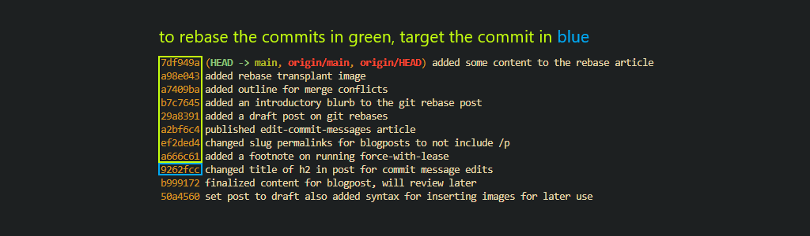

Have you or a loved one ever wanted to:

- delete a commit
- edit the content of a commit
- include missed files in a commit
- fix a typo in an old commit message
- combine a bunch of commits together
- sign older commits
- change what branch you've forked from

If you've worked with git, you've likely needed to do at least one of these at some point. And if you're like me, you've probably tried to read the `--help` documentation of git to figure out how to do some of these things, and oh boy the docs can be hard to read. This article is a reference on what you can do with git rebases, and how to do it.

## So What is a Git Rebase?

A git rebase is the act of disassembling and reassembling a range of commits. The function's name comes from its original purpose of changing the forked location of your branch to a different commit or branch.

## Determine What Commits to Rebase

You can use most valid forms of [gitrevision syntax](https://git-scm.com/docs/gitrevisions), but `git log --oneline` and `git reflog` are the most common options for discovering historical edits. `git log --oneline` will only show you commits. `git reflog` will show you commits in addition to actions you take like checking out branches, other rebases you've done, git resets, commit amends, and other historical modifications made to git. The only time I use referential syntax is if I'm recovering a previously deleted commit since git will locally log the commit even after deleting it.

Here's a table of a few valid gitrevision syntaxes you can use in a rebase, and what they roughly translate to.

|syntax|meaning|
|------|-------|
|`016a428`|rebase all commits between HEAD and `016a428`|
|`HEAD@{5}`|rebase all commits contained in my last 5 git actions|
|`HEAD~5`|rebase the last 5 commits|
|`HEAD@{5hr}`|rebase all commits made in the last 5 hours|
|`':/^Initial'`|rebase all commits made between HEAD and the first commit found with a commit message that matches the regular expression `^Initial`|

## Deleting Commits

## Editing Commit Content

## Combining Commits by Squashing

## Changing the Base of Your Branch

An example of that might be if you created branch `topic` while checked into branch `next` instead of branch `master` and you've already committed content you don't want to lose. `git rebase --help` has some nicely defined diagrams of what this would look like as illustrated below, or [here](https://git-scm.com/docs/git-rebase) if you want to read the official docs.

## Signing Older Commits