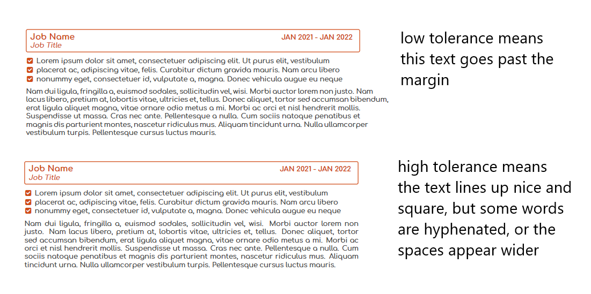
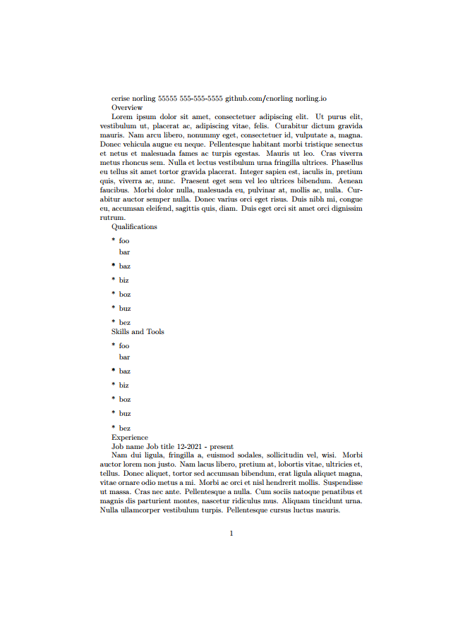
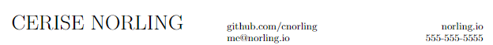
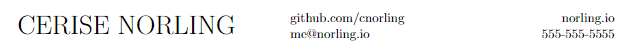
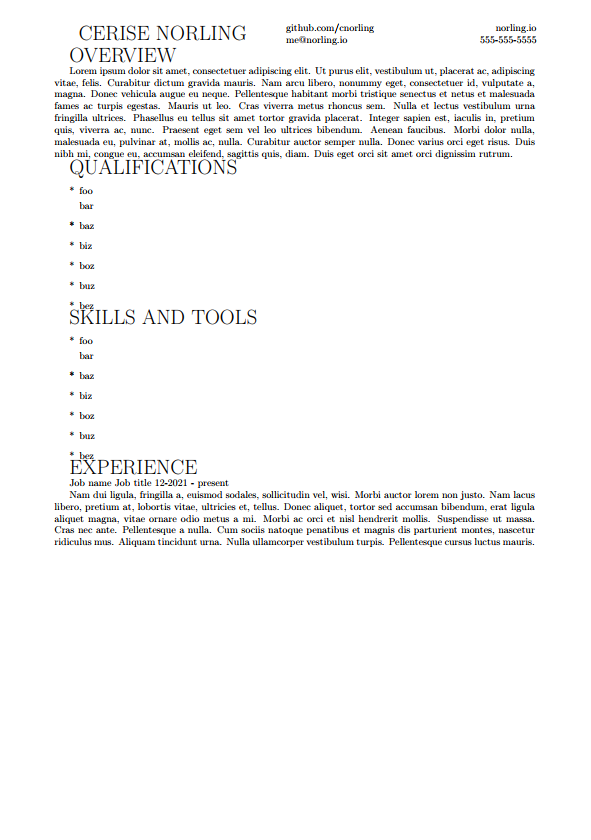
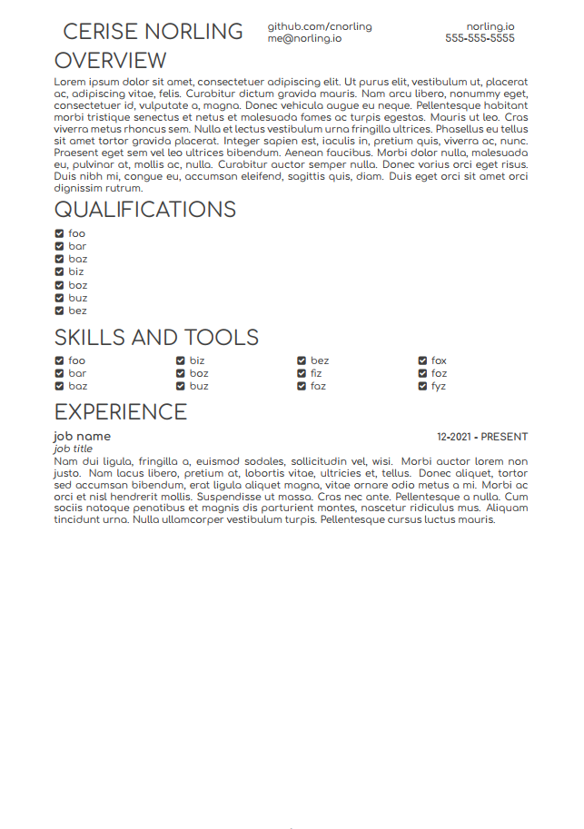
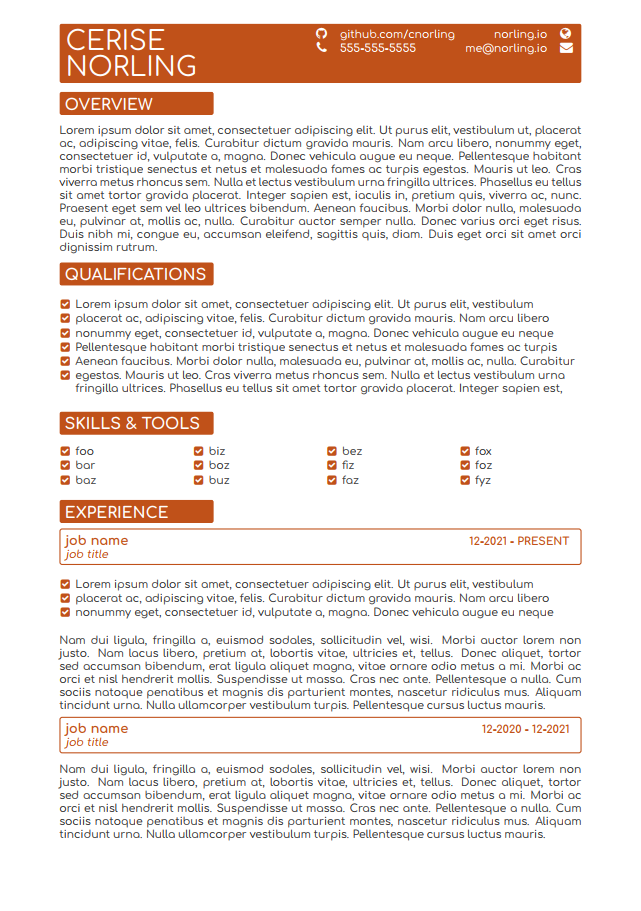

Writing LaTeX sucks, but the results are undeniably better than anything else. This article is a brief introduction into LaTeX, the basic prerequisites to writing documents, what the ecosystem is like, and what it was like writing my resume in LaTeX.

## Dark Times Before LaTeX

I am very picky about resume formatting. If things aren't perfectly aligned, it bothers me on a spiritual level. Before LaTeX, my solution for writing my resume was to make a table in Google Docs, organize the content into columns, and set the table line width to 0 so it would be transparent. This setup worked for quite some time, but it had drawbacks.

- changing the column width for one cell had implications for other cells
- the witdth of each cell was independent from other similar cells. This led to inconsistent spacing on the headers and sections
- content would shift between when the table was set to 1 or 0 line width
- a lot of cells had to be merged together
- content had to be manually shuffled around for appropriate page balancing


I felt really good about the results, but over time as I would make modifications the pain points started to wear on me. I spoke to a coworker about his resume, and he said he wrote his in LaTeX. I didn't know much about LaTeX; I knew it was frequently used for academic papers and was developed as an easier way to express mathematical equations.

My interest was piqued, and I decided to give it a shot. He gave me a copy of his resume, and I scanned over it to try and learn LaTeX. I also looked on Overleaf for public LaTeX resumes, but I didn't see anything that really looked like what I wanted. I ended up writing my own from scratch!

## LaTeX Concepts

### Environments

When you declare things like font, size, color, and other text modifiers, you're applying it to an environment. Think of an environment as something like a title, paragraph, footer, or table; A subsection of things that needs to be handled in a certain way. You can create your own environments, or you can use pre-made ones included in libraries. You can use a pre-made an environment like so

```latex
\begin{environmentName}
  I'm in the environment!
\end{environmentName}
```

Any text alterations you make inside that codeblock will only apply to that subset of text. You can declare your own custom environment like so

```latex
\newenvironment{foo}{
  % executes as the top portion of the environment
  \color{Green}
  \begin{list}{x}{\raggedright}
}{
  % executes as the bottom portion of the environment
  \end{list}
}
```

You can also have environments within environments

```latex
\begin{environmentName}
  I'm in the environment!
  \begin{foo}
    I'm in the custom environment!
  \end{foo}
\end{environmentName}
```

### Packages

TeXLive has a large number of default document classes and packages that are immediately available at your disposal, and you'll have to use a lot of them. Set a page's margins? Use `geometry`. Merge cells in a table? Use `multirow` or `multicol`. Color something? Use `xcolor`. Want to add a hyperlink? Use `hyperref`.

Package discovery largely entails scrawling through StackOverflow or Overleaf for threads where people talk about how to do things. Overall, the ecosystem is well documented with most LaTeX libraries choosing to document their programs in PDFs on CTAN. You can find an example of the geometry package [here](https://ctan.org/pkg/geometry).

You can import a package like so

```latex
\usepackage{fontawesome}
```

### Text Sizing

Because of how LaTeX handles text, you are limited to a small range of predetermined sizes that should meet most people's needs. If you want to go larger or smaller, you'll need to find a package with different supported sizes. Overleaf has some excellent docuemntation on font sizing you can read [here](https://www.overleaf.com/learn/latex/Font_sizes%2C_families%2C_and_styles).

### Fonts

Using a specific font isn't as easy as you might think it would be. To use a font, you first have to identify what the font's name as it's defined in LaTeX. Once you have that name, you can apply it to an environment like so

```latex
\begin{foo}
  \fontfamily{<familyname>}\selectfont
\end{foo}
```

Packages like fontenc make using fonts much easier. To look at fonts online, I'd recommend reading over the tug.org font catalogue https://tug.org/FontCatalogue

### Tolerance

Whenever a line of text is justified, LaTeX must make a determination on how much whitespace spread between words can be tolerated without looking weird. It also decides just how much you can go past a margin before it puts the next word on a newline. Tolerance is an integer set between 0 and 10000. It's easiest to understand in a picture



### Document Classes

There are many different types of documents, and all those documents have things in common regardless of who wrote the document. Classes are a collection of common parameters and characteristics in a document that should apply to all documents of that type. TeXLive includes a few document classes that you can use like report, book, article, or letter. Article is a good class to use if you want a blank template to work with.

### Functions and Variables

You declare a variable the same way you declare a function; Just create a function that returns the value you want assigned to the variable. You can then use that function wherever you want to.

### Drawing Things

There are a million ways to do what you probably want, and 50% of those ways will probably involve using TikZ. TikZ allows you to draw pictures in LaTeX. The way you draw pictures might be appealing to mathemeticians, but it's not a very enjoyable experience otherwise. There are a lot of packages that utilize TikZ to draw things for you in a more easy to write format.

I use a package called `mdframed` that uses TikZ to outline text boxes around words and color them.

## Writing the Resume

It can be very helpful to observe a project from creation to completion, so I've added a step by step example on github you can inspect to compare. A picture of the PDF output is included in the `README.md` of the repository so this blogpost doesn't get too long. You can find it here:
https://github.com/cnorling/resume-public/tree/main/example

### File Setup

I start by defining a document and a document class. `resume.cls` is the class and `resume.tex` is the document. I put shared functions and formatting related things in `resume.cls`. The content of the resume itself goes in `resume.tex`. I add some content to `resume.cls` to declare its parent document class, and link `resume.tex` to that class. I also add a special environment named document to `resume.tex` and put my name in it.


### Content

When working with a document that requires a lot of formatting, it can be helpful to have all your content already on the page so you can observe the text will behave as you make changes. For this example, there's a mix of real text and fake text. I'll use the lipsum package and add it to `resume.cls`. After it's imported, I can use the `\lipsum` directive to get some example content.

Some of the content needs to be handled differently from the others though. I'll declare a list environment for the qualifications and skills, then add some placeholder items to it.



### Heading

The first formatting thing I want to tackle is the page margins. I like my resume to have short vertical margins and wider horizontal margins. I can use the geometry package to setup page margins like so

```latex
\usepackage{geometry}
\geometry{
    a4paper,
    left=20mm,
    right=20mm,
    top=8mm,
    bottom=8mm,
}
```

The second formatting thing I want to tackle is the heading. Before I can do that, I need to add some variables so that I can use their content in `resume.cls`. After adding them with `\newcommand{\functionName}{string}` I can then call `\functionName` to access their output.

My heading isn't something that's really going to change, so the strategy I use for my heading is a function that takes no parameters that pulls from the variables we just declared. I define a heading command and add the content we have in our header like so

```latex
\newcommand{\heading}{
  \name
  \github
  \website
  \email
  \phone
  \address
}
```

I want things roughly aligned with where they need to go, and I can do that with an environment called a tabular. Table declarations in LaTeX are very finnicky. They look best as code when their content is kept simple and straightforward. We pass a few parameters to indicate how many cells we want, how wide those cells should be, and how they should align. We'll also want to use the package `tabularx` since it fixes some issues that native LaTeX tabulars have. Here's an example

```latex
\begin{tabular}{p{200pt} p{120pt} p{120pt}}
  % define the table content and separate cells with &
  % newlines in tables are declared with \\ at the end
  \name & \github & \website \\
        & \email & \phone
\end{tabular}
```

The document is already looking much better! The next thing I want to do is increase the size of my name and capitalize it as well as the sections. For that, we can use `\MakeUppercase{}` and `\huge`. I also want the things on the right side of the heading to align to the right side of the page; We can do that by applying the `>{\raggedright\arraybackslash}` directive to the columns in question.

```latex
\newcommand{\heading}{
  \begin{tabular}{p{200pt} p{120pt} >{\RaggedLeft}p{120pt}}
    \MakeUppercase{\huge\name} & \github & \website \\
                               & \email  & \phone
  \end{tabular}
}
```



My name looks bigger, but now the table's content is weirdly aligned. To fix this, I merge the empty cell below my name with the `multirow` package. It's at this point that I give up keeping rough cell alignment since the cast name is so long.

```latex
\newcommand{\heading}{
  \begin{tabular}{p{200pt} p{120pt} >{\RaggedLeft}p{120pt}}
    \multirow{2}{200pt}{\MakeUppercase{\huge\name}} & \github & \website \\
    & \email & \phone
  \end{tabular}
}
```



Okay my name is vertically aligned now, but that line to print my name is absurdly long and makes the table illegible from a code standpoint. I'm going to obfuscate how my name's casted with another command.

```latex
\newcommand{\heading}{
  \begin{tabular}{p{200pt} p{120pt} >{\RaggedLeft}p{120pt}}
    \multirow{2}{200pt}{\printName} & \github & \website \\
    & \email & \phone
  \end{tabular}
}

\newcommand{\printName}{
    \MakeUppercase{\huge\name}
}
```

That's a little better, but look at the progress!



### Formatting

#### Paragraph Indentation

To fix the paragraph indentation on this resume, I use the parskip package. I don't have the capability to fix the heading indentation at this time, but it won't be a problem with the styling we'll do later.

#### Hyphenated Linebreaks

Some of the words are spread across multiple lines, so I'll want to configure the page's tolerance and disable hyphenation with the `hyphenat` package.

#### Bullet Points

I'd prefer to use a nicer icon than just an asterisk. The favicon LaTeX library has a lot of good icons to use. I like `\faCheckSquare`
I want the bullet points to be in-line with the left side of the page, so I'll have to edit the list's parameters. I also want to change the separation between items to be tighter like so

```latex
  \begin{list}{\faCheckSquare}{
    \setlength{\leftmargin}{15pt}
    \setlength{\itemsep}{0pt}
    \itemsep -0.5em \vspace{-0.5em}
    \raggedright
  }
    \item foo
    \item bar
    \item baz
    \item biz
    \item boz
    \item buz
    \item bez
  \end{list}
```

#### Multiple Column List

I'd like the skills and tools to be spread out across the page. A package called `multicol` lets me spread a single list across multiple columns like so

```latex
  \begin{multicols}{4}
    \begin{list}{\faCheckSquare}{
      \setlength{\leftmargin}{15pt}
      \setlength{\itemsep}{0pt}
      \itemsep -0.5em \vspace{-0.5em}
      \raggedright
    }
      \item foo
      \item bar
      \item baz
      \item biz
      \item boz
      \item buz
      \item bez
      \item fiz
      \item faz
      \item fox
      \item foz
      \item fyz
    \end{list}
  \end{multicols}
```

Some of the formatting has leaked into the `resume.tex` file now with how things are setup. To fix this, I'll create a custom environment that declares the list as well as a few other options. The skills environment will have one parameter that we declare with `\newenvironment{envname}[3]{}{}` where the integer is how many arguments we want the function to have. Values from those parameters are used by referencing their integer in the position prefixed by a pound like this: `#1`

When you use the environment, you add a set of curly brackets after the environment's name with your input like this: `\begin{envname}{foo}{bar}{baz}`. Our use-case is much simpler though since we only have one parameter.

```latex
% resume.cls
\newenvironment{skills}[1]{
  \begin{multicols}{#1}
    \begin{list}{*}{
      \setlength{\leftmargin}{15pt}
      \setlength{\itemsep}{0pt}
      \itemsep -0.5em \vspace{-0.5em}
      \raggedright
    }
}{
    \end{list}
  \end{multicols}
}

% resume.tex
\begin{skills}{4}
  \item foo
  \item bar
  \item baz
  \item biz
  \item boz
  \item buz
  \item bez
  \item fiz
  \item faz
  \item fox
  \item foz
  \item fyz
\end{skills}
```

#### Vertical Padding

At this point, the spacing between the list we have for qualifications vs skills and tools is different, so I'll have to tweak the qualifications environment a bit with some padding to even things out `\vspace*{8pt}`.

What's that asterisk mean? Well, to be honest a lot of the default behaviors of LaTeX are inconsistent and sometimes undesirable. Rather than update the package, newer packages by maintainers are added to TeXlive to fix these issues. But now there are package naming conflicts. The solution is to change the case sensitivity of the package or suffix an asterisk at the end. `\vspace` and `\vspace*` are both different packages with different behaviors. If you see a package with an asterisk, you should use that over the default package because it's more likely up-to-date.

#### Font

We'll want to set the font too. I like `comfortaa`, so I'll set it globally with the `comfortaa` package.

#### Text Color

Black on white is very harsh on the eyes, so changing the text color will help. I can do that by configuring a default color in the class like this `\color{darkgray}`.

I'd like to also organize the job content similar to how the header is handled. I'll create a new environment that takes 3 parameters with a 2x2 table. To format the text, I'll bold the job and date, italicize the title, and capitalize the date. With this table, I'll need some more advanced formatting utilities so I'll use a `tabularx` instead.

```latex
% resume.cls
\newenvironment{job}[3]{
  \vspace{5pt}
  \begin{tabularx}{1\textwidth} {
    @{}>{\hsize=1\hsize\linewidth=\hsize\raggedright\arraybackslash}X@{}
    @{}>{\hsize=1\hsize\linewidth=\hsize\raggedleft\arraybackslash}X@{}
  }
    \textbf{\large #1} & \MakeUppercase{\textbf{#3}} \\
    \textit{#2}
  \end{tabularx}
}{}

% resume.tex
\begin{job}{job name}{job title}{12-2021 - present}
\end{job}
```



### Styling

Now I want to add some style to the page to make it less boring.

#### Favicons and Hyperlinks

With the favicon package I imported earlier, I can add some cool icons to the header. I'll need to expand the table width and add a few more helper functions and packages to setup hyperlinks and size the icons; The `hyperref` package lets me setup hyperlinks. I'll also configure a color variable globally and use that later on.

```latex
\newcommand{\heading}{
  \begin{tabular}{ p{200pt} >{\raggedleft\arraybackslash}p{30pt} p{90pt}>{\raggedleft\arraybackslash} p{90pt} >{\raggedright\arraybackslash} p{30pt} }
    \multirow{2}{200pt}{\printName} & \icogithub & \github & \website & \icowebsite \\
    & \icophone & \phone & \email & \icomail
  \end{tabular}
}

\newcommand{\printName}{\MakeUppercase{\huge \name}}
\newcommand{\ico}[2]{{\large\href{#1}{#2}}}
\newcommand{\icogithub}{\ico{https://github.com/\github}{\faGithub}}
\newcommand{\icomail}{\ico{mailto:\email}{\faEnvelope}}
\newcommand{\icophone}{\ico{tel:\phone}{\faPhone}}
\newcommand{\icowebsite}{\ico{https://\website}{\faGlobe}}
\newcommand{\setcolor}{\color{\colour}}
```

#### Text Boxes

I found a package called `mdframed` that lets me draw boxes around text. It works by allowing you to declare a type of environment that's specific to the `mdframed` package. I declare a positive and negative variant for some variety on the page like so

```latex
\newmdenv[
  middlelinewidth=0pt,
  backgroundcolor=\colour,
  roundcorner=2pt,
  fontcolor=White,
  innerleftmargin=5pt,
  innertopmargin=-8pt,
  userdefinedwidth=150pt
]{infobox}

\newmdenv[
  userdefinedwidth=\textwidth,
  linecolor=\colour,
  linewidth=1pt,
  backgroundcolor=White,
  roundcorner=2pt,
  fontcolor=\colour,
  innerleftmargin=5pt,
  innerbottommargin=2pt
]{infoboxinvert}
```

I use the infobox like I would any ordinary environment. For the header, I'm going to override a few settings on the infobox. I'll also tweak the name to be splayed across two lines by adjusting the multirow cell width like so

```latex
\newcommand{\heading}{
  \begin{infobox}[
    innertopmargin=4pt,
    innerbottommargin=25pt,
    innerleftmargin=0pt
  ]
    \begin{tabular}{ p{200pt} >{\raggedleft}p{30pt} p{90pt}>{\raggedleft} p{90pt} >{\raggedright\arraybackslash} p{30pt} }
      \multirow{2}{150pt}{\printName} & \icogithub & \github & \website & \icowebsite \\
      & \icophone & \phone & \email & \icomail
    \end{tabular}
  \end{infobox}
}
```

Now I'll wrap the job environment in the inverted infobox.

```latex
\newenvironment{job}[3]{
  \vspace{5pt}
  \begin{infoboxinvert}[]
    \begin{tabularx}{1\textwidth} {
      @{}>{\hsize=1\hsize\linewidth=\hsize\raggedright\arraybackslash}X@{}
      @{}>{\hsize=1\hsize\linewidth=\hsize\raggedleft\arraybackslash}X@{}
    }
      \textbf{\large #1} & \MakeUppercase{\textbf{#3}} \\
      \textit{#2}
    \end{tabularx}
  \end{infoboxinvert}
}{}
```

For the sections, I'll declare a function that uses the infobox environment and accepts a parameter for the section name. I'll configure the width of the boxes to be static so they all align down the page.

```latex
\newcommand{\sector}[1]{
  \begin{infobox}[userdefinedwidth=143pt]
    \section*{\MakeUppercase{#1}}
  \end{infobox}
}
```

I'll set the color of the checkboxes as well with the `\setcolor` command I defined earlier.

```latex
\newenvironment{skills}[1]{
  \vspace*{-5pt}
  \begin{multicols}{#1}
    \begin{list}{\setcolor\faCheckSquare}{
      \setlength{\leftmargin}{15pt}
      \setlength{\itemsep}{0pt}
      \itemsep -0.5em \vspace{-0.5em}
      \raggedright
    }
}{
    \end{list}
  \end{multicols}
  \vspace*{-5pt}
}
```

I'll also update some of the placeholder content to be more like an actual resume.



## Ending Notes

LaTeX is a very old language with a lot of inconsistencies, weird syntax, and small issues that can make it a frustrating language to work with. That being said, I love the results and will definitely use it going forward. If you'd like to see this resume on github, check it out [here](https://github.com/cnorling/resume-public)! You're more than welcome to fork it for personal use and tweak it however you like =\]

Thanks for reading!
