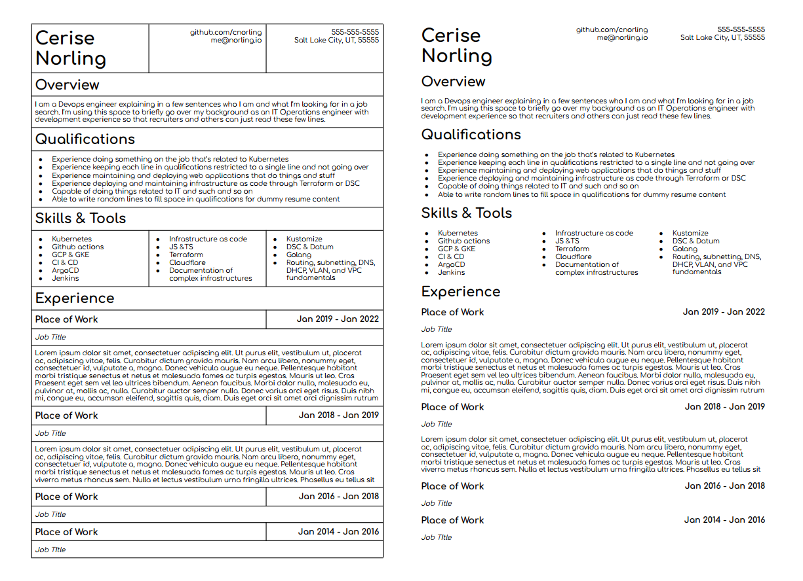

Writing LaTeX sucks, but the results are undeniably better than anything else. This article is a brief introduction into LaTeX, the basic prerequisites to writing documents, what the ecosystem is like, and how you can write your resume in LaTex.

# Dark Times Before LaTeX

I am very picky about resume formatting. If things aren't perfectly aligned, it bothers me on a spiritual level. Before LaTeX, my solution for writing my resume was to make a table in google docs, organize the content into columns, and set the table line width to 0 so it would be transparent. This setup worked for quite some time, but it had drawbacks.

- changing the column width for one cell had implications for other cells
- the witdth of each cell was independent from other similar cells. This led to inconsistent spacing on the headers and sections
- content would shift between when the table was set to 1 or 0 line width
- a lot of cells had to be merged together
- content had to be manually shuffled around for appropriate page balancing

I felt really good about the results, but over time as I would make modifications the pain points started to wear on me. I spoke to a coworker about his resume, and he said he wrote his in LaTeX. I didn't know much about LaTeX; I knew it was frequently used for academic papers and was developed as an easier way to express mathematical equations.

My interest was piqued, and I decided to give it a shot. I looked on Overleaf for public LaTeX resumes, but I didn't see anything that really looked like what I wanted. I ended up writing my own from scratch!

# LaTex Basics

## Fundamentals

### Environments

## Weird Things Specific To LaTeX

### There is no good way to declare variables

### Conditional logic operations are difficult to do

### Any documentation you find is likely going to also be written in LaTeX as a PDF

### There are a million ways to do what you probably want, and 50% of those ways will probably involve using TikZ

TikZ allows you to draw pictures in LaTeX. The way you draw pictures might be appealing to mathemeticians, but it's not a very enjoyable experience otherwise. There are a lot of packages that utilize TikZ to draw things for you in a more easy to write format.

I use a package called `mdframed` that uses TikZ to outline text boxes around words and color them.

### You need to import packages to do pretty much anything

TeXLive has a large number of default document classes and packages that are immediately available at your disposal, and you'll have to use a lot of them. Set a page's margins? Use `Geometry`. Merge cells in a table? Use `multirow` or `multicol`. Color something? Use `xolor`. Want to add a hyperlink? Use `hyperref`.

Package discovery largely entails scrawling through StackOverflow for threads where people talk about how to do things.

# Writing the Resume
