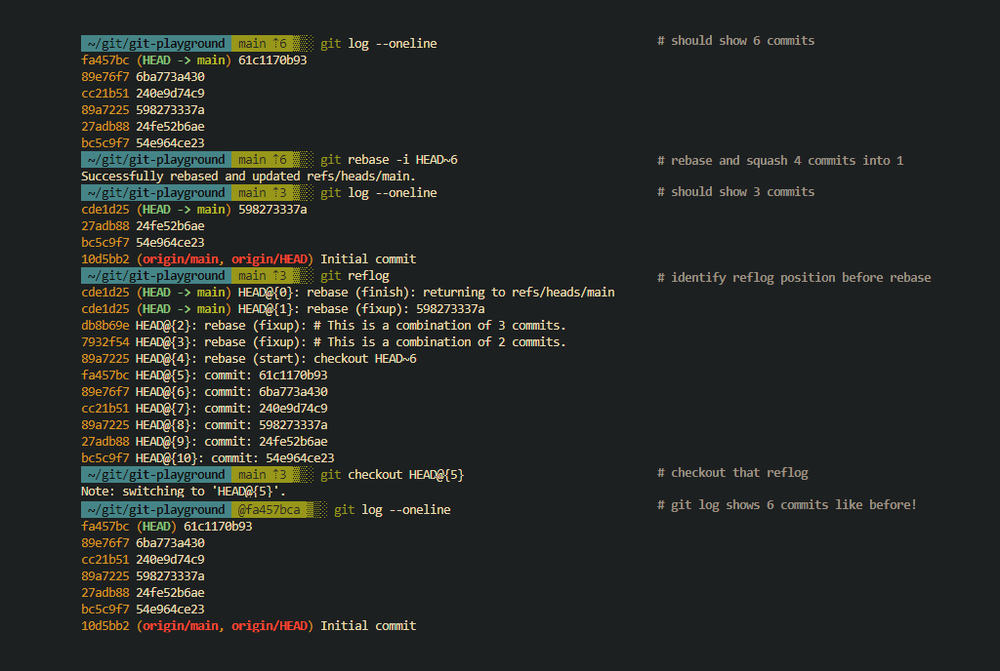
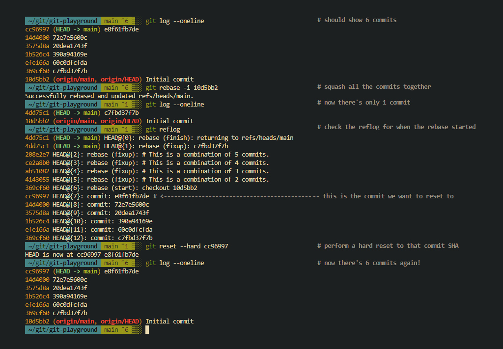
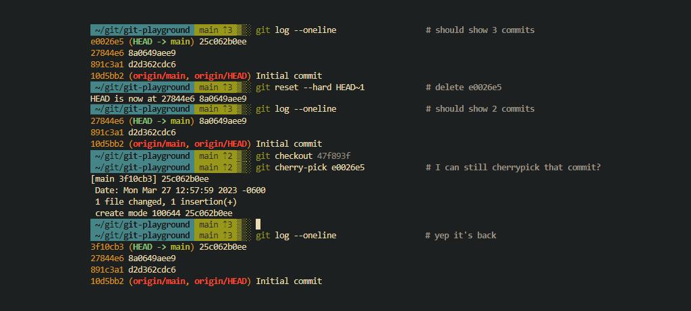

When rebasing, it's inevitable that you will delete something you didn't intend to, or finish a rebase before you're actually done. When this happens, the best thing you can do is take a step back and truly evaluate the current state of the remote repository and your local repository.

- Is the content actually deleted?
- Have I pushed my changes out yet?
- Could someone else have a copy of the content I deleted?

Even if you've already force pushed out your changes, there are ways to recover deleted content.

## Check if there's anything in git reflog

Git Reflog is a _referential log_ of all the states your local git repository has been in. Every removed branch, deleted commit, unsigned commit, previously squashed commits, even viewing a specific commit SHA is logged and recorded. Reflog is a local only thing, so if you delete a local git repository and clone it down again you'll lose all your reflogs.

You can access your referential logs by running `git reflog`. By default, it retains the last 90 days of git activity. Every time you run a git specific action, git runs a garbage collector that discards anything outside the defined retention period. If you wanted to, you could increase this threshold by running `git config gc.reflogExpire 120`. Don't forget to pass `--global` if you want it to apply to all repositories.

### Accessing reflogs

All reflogs are dynamic and measured according to an offset from your latest action. To access reflogs, first you need to identify which reflog to examine. Run `git reflog` to identify the state you want to examine. Then run `git checkout HEAD{23}` where 23 is the number offset from `git reflog`.

In this state, you can poke around and look at the file content to confirm that it is what it should be.

### Accessing git logs within reflogs

Since reflogs are a capture of the repository's state at that time, they also have the historical output from `git log`. If you need to identify a commit SHA that's no longer in `git log`, you can checkout an earlier reflog and run `git log` to browse commits that were associated with your branch at that point in time. It's very useful for identifying deleted content.

### What if I don't have reflogs?

Even if your reflogs are empty, if you know the commit SHA or have tagged a specific commit you can perform a `git reset --hard $SHA` to reset to that point in time. The trick there is to know the SHA since if there's no reflog, you're going to have a hard time finding the SHA if it's just local.

## Examples

### Completely undoing a git rebase

Undoing a rebase completely actually isn't that bad. The process is simply to identify the commit SHA or reflog before the rebase started, then perform a `git reset --hard $REF` like so

### Cherrypicking deleted commits

If you need to be more selective about what you do and don't recover, cherrypicking commit SHAs might be a good option for you.

The hard part is knowing and discovering the commit SHA you intend to recover. Even after you delete commits, they still exist both locally and (maybe) remotely. If you're trying to recover a deleted commit and you know the commit SHA, you can run `git cherry-pick $SHA` to get that commit back. After the cherrypick, the commit SHA might change since it's now incorporating the changes between how far back from head it was and where it is now.

_(unless the deleted commit was the latest one, then it will be the same)_

## Summary

Unless you've configured your git garbage collector to discard reflogs, you definitely have everything you need to fix a messed up git rebase. I hope you learned something from this article!

If you have any issues or questions, you're more than welcome to send an email to me@norling.io :\]
